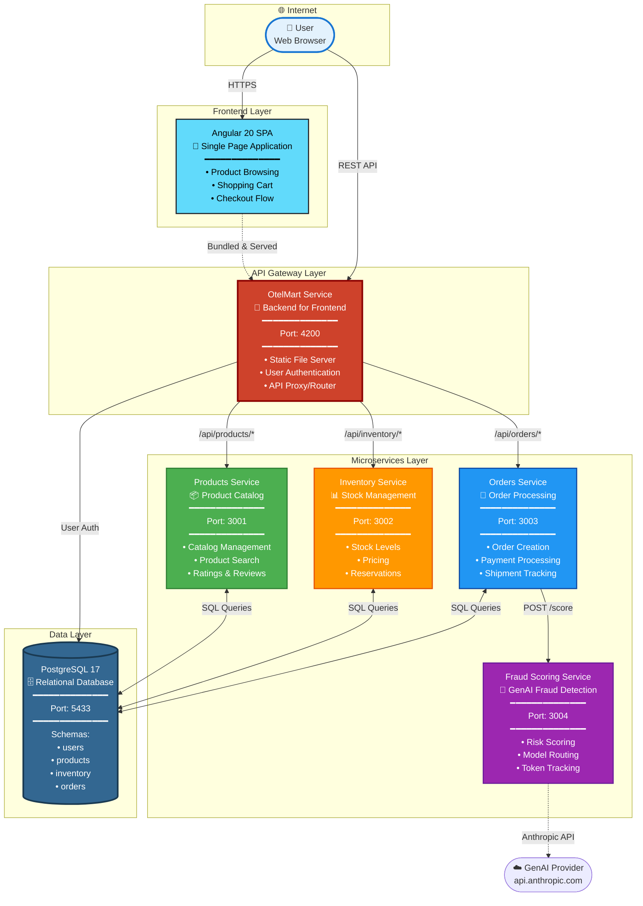
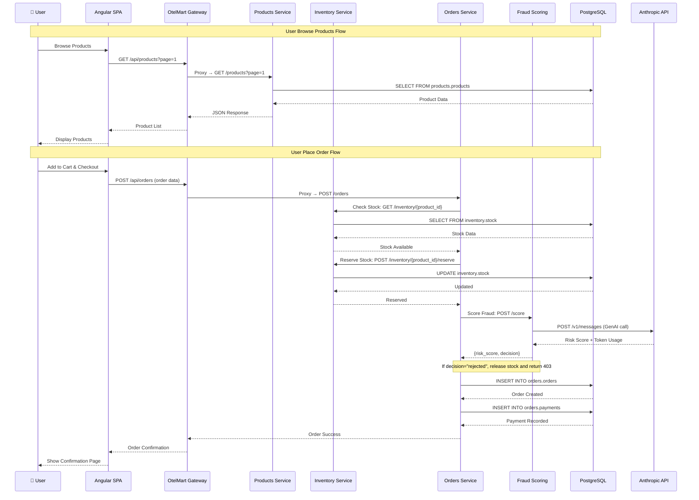
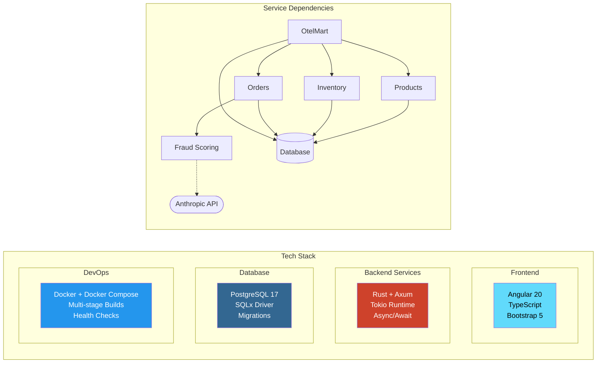
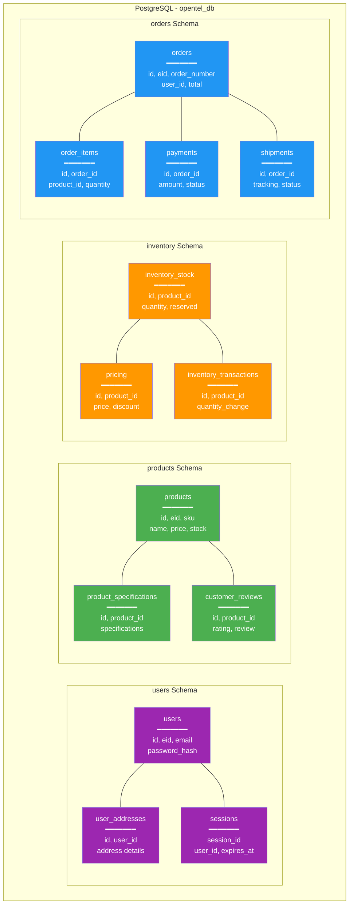
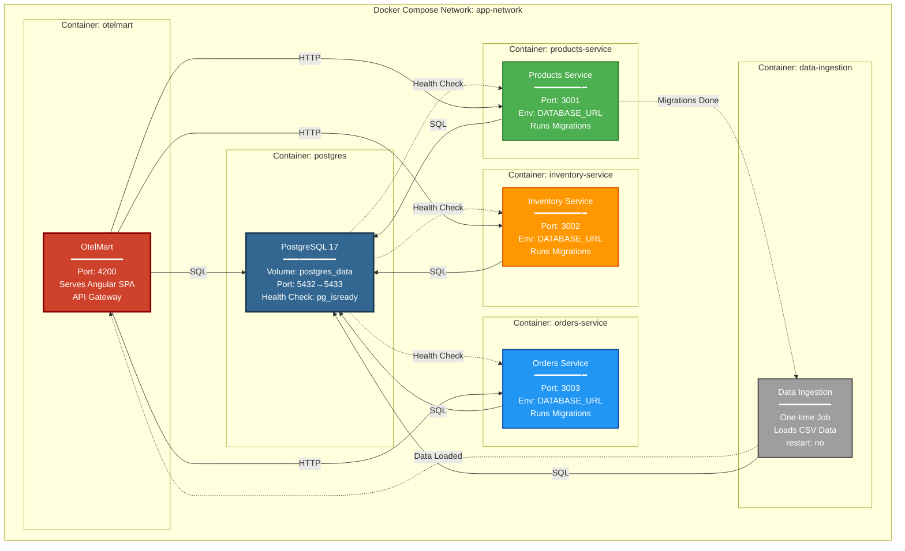
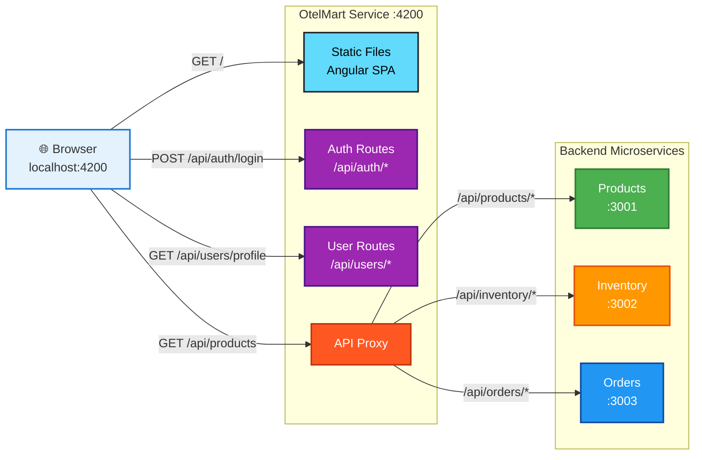

# OpenTel E-Commerce - Architecture Documentation

## 1. High-Level System Architecture

---

## 2. Detailed Service Communication Flow

---

## 3. Service Dependencies & Technology Stack

---

## 4. Database Schema Organization

---

## 5. Docker Container Architecture

---

## 6. Request Routing Details

---

## Key Architecture Decisions

### ✅ **Microservices Benefits**
- **Independent Scaling**: Each service can scale independently
- **Technology Flexibility**: Each service could use different tech (though all use Rust here)
- **Isolated Failures**: One service failure doesn't bring down entire system
- **Team Autonomy**: Different teams can own different services

### 🏗️ **API Gateway Pattern**
- **Single Entry Point**: OtelMart acts as unified API gateway
- **Cross-Cutting Concerns**: Authentication, CORS, logging handled centrally
- **Backend for Frontend**: Tailored for web client needs
- **Service Discovery**: Routes requests to appropriate microservices

### 📊 **Database Strategy**
- **Logical Separation**: Different schemas per service (users, products, inventory, orders)
- **Shared Database**: Simplified for learning (not ideal for production microservices)
- **Migration Management**: Each service manages its own schema migrations
- **Performance**: Indexes on all foreign keys and common query patterns

### 🐳 **Containerization**
- **Docker Compose**: Orchestrates all services locally
- **Health Checks**: Ensures proper startup order
- **Networking**: All services communicate via Docker network
- **Volumes**: Persistent database storage

### 🔍 **Observability Ready**
This architecture is designed for OpenTelemetry instrumentation:
- Distributed tracing across service boundaries
- Metrics collection from each service
- Structured logging with correlation IDs
- Context propagation via HTTP headers

---

## Port Reference

| Service | Internal Port | External Port | Purpose |
|---------|--------------|---------------|---------|
| PostgreSQL | 5432 | 5433 | Database connections |
| Products | 3001 | 3001 | Product API |
| Inventory | 3002 | 3002 | Inventory API |
| Orders | 3003 | 3003 | Orders API |
| OtelMart | 4200 | 4200 | Web App + Gateway |

---

## Startup Sequence

1. **PostgreSQL** starts with health checks
2. **Products, Inventory, Orders** services start and run migrations
3. **Data Ingestion** loads initial product data (runs once)
4. **OtelMart** starts serving Angular app and proxying APIs

All services wait for PostgreSQL health check before connecting.
